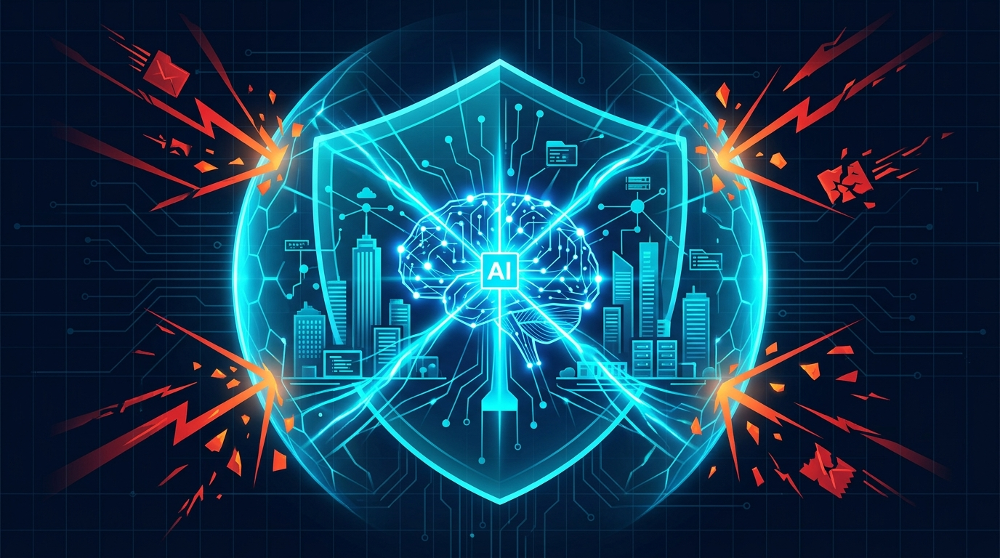

# Anthropic's Cyber Mission: AI in Defensive Security

Anthropic is accelerating its push into the enterprise cybersecurity sector with new initiatives designed to leverage Large Language Models (LLMs) like Claude for defensive cyber operations. By deploying AI to analyze threat intelligence, automate incident response, and identify zero-day vulnerabilities in codebase audits, Anthropic aims to shift the paradigm from reactive patching to proactive AI-driven defense.\n\nOur latest industry briefing explores Anthropic's emerging cyber mission, the technical capabilities of Claude in a Security Operations Center (SOC) environment, and the future of AI-augmented cybersecurity teams.\n\nRead the full strategic analysis on our official security portal.

**[Read the full technical breakdown here](https://cyberupdates365.com/anthropic-cyber-mission/)**

---
*Maintained by Kiran Sonawane | Senior Cloud & DevOps Engineer*
